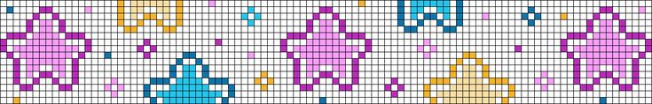

# Egocentric vs Allocentric Spatial Representations in Reinforcement Learning



> **Research Project**: Investigating how spatial perspective (egocentric vs allocentric) affects RL agent performance across navigation and object-interaction tasks.

---

## 📑 Table of Contents

- [Project Overview](#project-overview)
- [Repository Structure](#repository-structure)
- [Installation](#installation)
- [Quick Start Guide](#quick-start-guide)
- [Training](#training)
- [Evaluation](#evaluation)
- [Visualization](#visualization)
- [Analysis & Statistics](#analysis--statistics)
- [Results](#results)
- [Troubleshooting](#troubleshooting)

---

## 🎯 Project Overview

This project systematically compares **egocentric** (agent-centered, first-person) and **allocentric** (world-centered, bird's-eye) spatial representations in deep reinforcement learning. We train PPO and DQN agents across multiple MiniGrid environments with 3 random seeds per configuration.

### Key Findings

1. **Training instability dominates**: PPO shows CV=86.6% on Empty-8x8 (both perspectives)
2. **GoToObject shows clear difference**: Egocentric 69% vs Allocentric 56% (d=1.91)
3. **Color overfitting**: All agents drop 90% when door/key colors change
4. **Algorithm matters more**: DQN stable (0% variance), PPO variable (7-87% variance)

### Environments Tested

| Environment | Task Type | Complexity |
|-------------|-----------|------------|
| **Empty-5x5** | Pure navigation | Simple |
| **Empty-8x8** | Pure navigation | Medium |
| **DoorKey-5x5** | Object interaction + memory | Complex |
| **GoToObject-6x6** | Object recognition + navigation | Medium |

---

## 📁 Repository Structure

```
your_project/
│
├── 📄 README.md                              # This file
├── 📄 requirements.txt                       # Python dependencies
│
├── 🔧 Core Training Scripts
│   ├── train_sb3.py                         # Main training script (multi-seed support)
│   ├── visualize_sb3.py                     # Visualization + evaluation
│   └── manual_control.py                    # Human play (testing environments)
│
├── 📊 Evaluation Scripts
│   ├── evaluate_models.py                   # Standard evaluation (fixed start)
│   ├── evaluate_random_start.py             # Random start generalization
│   ├── evaluate_doorkey_variants.py         # Color generalization (DoorKey)
│   ├── evaluate_transfer_empty5x5_to_8x8.py # Size transfer learning
│   ├── evaluate_gotoobject_with_key.py      # Distractor robustness
│   └── visualize_suspicious_behaviors.py    # Failure mode diagnosis
│
├── 📈 Analysis & Plotting
│   ├── plot_training_metrics.py             # Multi-seed training curves
│   ├── plot_gotoobject_comparison.py        # GoToObject visualization
│   ├── statistical_analysis.py              # Statistical tests (Mann-Whitney, Cohen's d)
│   └── check_gpu_capacity.py                # GPU info checker
│
├── 🧩 Environment & Wrappers
│   └── envs/
│       ├── envs.py                          # Custom environments
│       ├── wrappers.py                      # Observation wrappers (ego/allo)
│       └── babyai_utils/                    # Helper utilities
│
├── 💾 Output Directories
│   ├── models/                              # Trained models (.zip files)
│   ├── logs/                                # Training logs (.json files)
│   ├── results/                             # Evaluation results (.csv files)
│   │   └── evaluations/                     # Per-model evaluation JSONs
│   ├── plots/                               # Generated plots (.png files)
│   ├── images/                              # Visualization GIFs
│   └── diagnosis_videos/                    # Failure analysis videos
│
└── 📝 Documentation
    ├── Research Proposal.pdf                # Original research proposal
    └── STATISTICS_GUIDE.md                  # Statistical analysis guide
```

---

## 🛠️ Installation

### Prerequisites

- Python 3.8+
- CUDA-capable GPU (recommended)
- 8GB+ RAM

### Step 1: Clone Repository

```bash
git clone https://github.com/yourusername/rl-spatial-representations.git
cd rl-spatial-representations
```

### Step 2: Create Virtual Environment

```bash
python -m venv venv
source venv/bin/activate  # On Windows: venv\Scripts\activate
```

### Step 3: Install Dependencies

```bash
pip install -r requirements.txt
```

### Step 4: Verify Installation

```bash
python check_gpu_capacity.py
```

Expected output:
```
✓ GPU Available: NVIDIA GeForce RTX 3090
  Total VRAM: 24.00 GB
  ...
```

---

## 🚀 Quick Start Guide

### 30-Second Demo

Train a simple agent and visualize results:

```bash
# 1. Train PPO on Empty-5x5 (1 seed, ~2 minutes)
python train_sb3.py --env_key MiniGrid-Empty-5x5-v0 --agent_type ppo --egocentric --single_seed 0 --save_model

# 2. Visualize the trained agent
python visualize_sb3.py --env_key MiniGrid-Empty-5x5-v0 --agent_type ppo --egocentric --seed 0 --episodes 3

# 3. Create GIF
python visualize_sb3.py --env_key MiniGrid-Empty-5x5-v0 --agent_type ppo --egocentric --seed 0 --save --episodes 5 --fps 3
```


---

## 🎓 Training

### Basic Training Command

```bash
python train_sb3.py --env_key <ENVIRONMENT> --agent_type <AGENT> [OPTIONS]
```

### Training with 3 Random Seeds (Recommended)

```bash
# Train PPO-Egocentric on DoorKey (3 seeds)
python train_sb3.py \
    --env_key MiniGrid-DoorKey-5x5-v0 \
    --agent_type ppo \
    --egocentric \
    --seeds 0 1 2 \
    --save_model
```

### Training Examples

#### 1. Empty Navigation (Simple)
```bash
# Egocentric
python train_sb3.py --env_key MiniGrid-Empty-5x5-v0 --agent_type ppo --egocentric --seeds 0 1 2 --save_model

# Allocentric
python train_sb3.py --env_key MiniGrid-Empty-5x5-v0 --agent_type ppo --seeds 0 1 2 --save_model
```

#### 2. DoorKey (Object Interaction)
```bash
# DQN-Allocentric
python train_sb3.py --env_key MiniGrid-DoorKey-5x5-v0 --agent_type dqn --seeds 0 1 2 --save_model
```

#### 3. GoToObject (Recognition)
```bash
# PPO-Egocentric (our main finding!)
python train_sb3.py --env_key MiniGrid-GoToObject-6x6-N2-v0 --agent_type ppo --egocentric --seeds 0 1 2 --save_model
```

### Training Parameters

| Parameter | Description | Default |
|-----------|-------------|---------|
| `--env_key` | MiniGrid environment name | `MiniGrid-Empty-5x5-v0` |
| `--agent_type` | Algorithm: `ppo` or `dqn` | `ppo` |
| `--egocentric` | Use egocentric view (omit for allocentric) | `False` |
| `--seeds` | List of random seeds | `[0, 1, 2]` |
| `--single_seed` | Train only one seed | `None` |
| `--save_model` | Save trained model | `False` |
| `--load_model` | Continue from checkpoint | `False` |

### Training Times (RTX 3090)

| Environment | Steps | PPO Time | DQN Time |
|-------------|-------|----------|----------|
| Empty-5x5 | 50k | ~2 min | ~3 min |
| Empty-8x8 | 100k | ~5 min | ~7 min |
| DoorKey-5x5 | 500k | ~25 min | ~35 min |
| GoToObject | 200k | ~10 min | ~15 min |

### Output Files

After training, you'll find:
```
models/
├── MiniGrid-Empty-5x5-v0_ppo_egocentric_seed0.zip
├── MiniGrid-Empty-5x5-v0_ppo_egocentric_seed1.zip
└── MiniGrid-Empty-5x5-v0_ppo_egocentric_seed2.zip

logs/
├── MiniGrid-Empty-5x5-v0_ppo_egocentric_seed0_TIMESTAMP.json
├── MiniGrid-Empty-5x5-v0_ppo_egocentric_seed1_TIMESTAMP.json
└── MiniGrid-Empty-5x5-v0_ppo_egocentric_seed2_TIMESTAMP.json
```

---

## 📊 Evaluation

### 1. Standard Evaluation (Fixed Start)

Evaluate trained models on their training conditions:

```bash
python evaluate_models.py --env_key MiniGrid-Empty-5x5-v0 --n_episodes 100 --seeds 0 1 2
```

**Output:** `results/comparison_table.csv`

### 2. Random Start Generalization

Test if agents memorized initial positions:

```bash
python evaluate_random_start.py --env_key MiniGrid-Empty-5x5-v0 --n_episodes 100
```

**Output:** `results/random_start_eval.csv`

**Key Finding:** PPO-Ego drops 49%, PPO-Allo only 12%

### 3. Color Generalization (DoorKey)

Test if agents learned "keys open doors" vs "yellow opens yellow":

```bash
python evaluate_doorkey_variants.py --n_episodes 100
```

**Output:** `results/doorkey_variants.csv`

**Key Finding:** ALL agents drop ~90% (catastrophic overfitting!)

### 4. Size Transfer (5x5 → 8x8)

Test if agents scale to larger environments:

```bash
python evaluate_transfer_empty5x5_to_8x8.py --n_episodes 100
```

**Output:** `results/transfer_5x5_to_8x8.csv`

### 5. Distractor Robustness (GoToObject + Key)

Test if agents handle extra objects:

```bash
python evaluate_gotoobject_with_key.py --n_episodes 100
```

**Output:** `results/gotoobject_key_generalization.csv`

**Key Finding:** Ego drops 17.7%, Allo drops 21.3%

### 6. Failure Diagnosis

Analyze why agents fail:

```bash
# Diagnose the suspicious PPO-Ego Empty-8x8 failure
python visualize_suspicious_behaviors.py \
    --env_key MiniGrid-Empty-8x8-v0 \
    --agent_type ppo \
    --egocentric \
    --seed 1 \
    --episodes 100 \
    --save_video
```

**Output:** 
- Console: Action distribution, exploration metrics
- `diagnosis_videos/`: GIF of failed episodes

---

## 🎨 Visualization

### 1. Watch Trained Agent (Interactive)

```bash
python visualize_sb3.py \
    --env_key MiniGrid-DoorKey-5x5-v0 \
    --agent_type ppo \
    --egocentric \
    --seed 0 \
    --episodes 5
```

### 2. Create GIF

```bash
python visualize_sb3.py \
    --env_key MiniGrid-DoorKey-5x5-v0 \
    --agent_type ppo \
    --egocentric \
    --seed 0 \
    --save \
    --episodes 10 \
    --fps 3
```

**Output:** `images/MiniGrid-DoorKey-5x5-v0_ppo_egocentric_seed0_sb3.gif`


### 3. Evaluate with 100 Episodes

```bash
python visualize_sb3.py \
    --env_key MiniGrid-GoToObject-6x6-N2-v0 \
    --agent_type ppo \
    --egocentric \
    --seed 0 \
    --evaluate \
    --eval_episodes 100 \
    --save_eval
```

**Output:** `results/evaluations/MODEL_NAME_eval.json`

---

## 📈 Analysis & Statistics

### 1. Statistical Tests

Perform Mann-Whitney U tests and calculate effect sizes:

```bash
python statistical_analysis.py --mode all --visualize
```

**Output:**
- `results/statistical_analysis.csv` - p-values, Cohen's d, etc.
- `results/variance_analysis.csv` - CV across seeds
- `plots/statistical/*.png` - Comparison plots

### 2. Training Curves (Multi-Seed)

Plot mean ± std across seeds:

```bash
# Plot all metrics
python plot_training_metrics.py --mode multiseed --env_key "MiniGrid-Empty-8x8-v0" --agent_type ppo

# Plot only specific metrics
python plot_training_metrics.py \
    --mode multiseed \
    --env_key "MiniGrid-GoToObject-6x6-N2-v0" \
    --agent_type ppo \
    --plot_types returns success entropy
```

**Output:** `plots/Empty-8x8_ppo_egocentric_multiseed.png`


### 3. Ego vs Allo Comparison

```bash
python plot_training_metrics.py \
    --mode compare \
    --env_key "MiniGrid-GoToObject-6x6-N2-v0" \
    --comparison observation \
    --plot_types returns success
```

**Output:** `plots/comparison_GoToObject-6x6-N2_ego_vs_allo.png`

### 4. GoToObject Visualization

Create publication-quality comparison plot:

```bash
python plot_gotoobject_comparison.py
```

**Output:** `plots/gotoobject_comparison.png`


---

## 🔬 Results Summary

### Main Findings Table

| Environment | PPO-Ego | PPO-Allo | DQN-Ego | DQN-Allo |
|-------------|---------|----------|---------|----------|
| Empty-5x5 | 100% (CV=0%) | 100% (CV=0%) | 100% (CV=0%) | 100% (CV=0%) |
| **Empty-8x8** | **67% (CV=87%)** | **67% (CV=87%)** | 100% (CV=0%) | 100% (CV=0%) |
| DoorKey-5x5 | 78% (CV=49%) | 86% (CV=21%) | 100% (CV=0%) | 100% (CV=0%) |
| **GoToObject** | **69% (CV=7%)** | **56% (CV=16%)** | - | - |

**Legend:** CV = Coefficient of Variation (training stability metric)

### Statistical Results

| Comparison | p-value | Cohen's d | Significant? |
|------------|---------|-----------|--------------|
| Empty-5x5 (PPO) | 1.000 | - | No |
| Empty-8x8 (PPO) | 1.000 | 0.00 | No |
| DoorKey (PPO) | 1.000 | -0.26 | No |
| **GoToObject (PPO)** | **0.200** | **1.91** | **Large Effect** |

### Generalization Results

| Test Type | PPO-Ego | PPO-Allo | Drop Difference |
|-----------|---------|----------|-----------------|
| Random Start (Empty-5x5) | 51% (-49%) | 88% (-12%) | Ego worse |
| Random Colors (DoorKey) | 9% (-91%) | 6% (-94%) | Both catastrophic |
| Size Transfer (5x5→8x8) | [YOUR DATA] | [YOUR DATA] | [TBD] |
| Key Distractor (GoToObject) | 52% (-17.7%) | 34% (-21.3%) | Ego better |

---

## 🐛 Troubleshooting

### Common Issues

#### 1. "Model not found" Error

```bash
# Check available models
ls models/

# Make sure you trained with matching parameters
python train_sb3.py --env_key MiniGrid-Empty-5x5-v0 --agent_type ppo --egocentric --seeds 0 1 2 --save_model
```

#### 2. "No log files found"

```bash
# Check logs directory
ls logs/

# Training might have failed - check for errors during training
```

#### 3. Entropy Plot Empty

**Problem:** PPO model but no entropy shown

**Solution:** 
- Entropy logging was added later - retrain models
- Or use `--plot_types returns success` to skip entropy

#### 4. CUDA Out of Memory

```bash
# Check GPU usage
python check_gpu_capacity.py

# Reduce batch size or train sequentially
python train_sb3.py --single_seed 0  # Train one seed at a time
```

#### 5. Import Errors

```bash
# Reinstall dependencies
pip install --upgrade -r requirements.txt

# Check gym_minigrid version
pip show gym-minigrid
```

### Getting Help

If you encounter issues:

1. Check the error message carefully
2. Verify file paths exist
3. Ensure models were trained with correct parameters
4. Check GPU memory if training fails
5. Open an issue on GitHub with:
   - Full error message
   - Command you ran
   - Python version and GPU specs

---

## 📚 Additional Documentation

- **Statistical Analysis Guide:** See `STATISTICS_GUIDE.md`
- **Research Proposal:** See `Research Proposal.pdf`
- **Code Comments:** All scripts have detailed docstrings

---

## 🎓 Citation

If you use this code in your research, please cite:

```bibtex
@misc{lebogang2025egocentric,
  title={Investigating the Impact of Egocentric and Allocentric Spatial Representations on Reinforcement Learning Performance},
  author={Lebogang, Maboa Wiendy},
  year={2025},
  school={University of the Witwatersrand}
}
```

---

## 📄 License

This project is licensed under the MIT License.

---

## 🙏 Acknowledgments

- **Supervisor:** Dr. Geraud Nangue Tasse
- **Institution:** University of the Witwatersrand, Johannesburg
- **Libraries:** Stable-Baselines3, MiniGrid, PyTorch

---

## 📞 Contact

**Maboa Wiendy Lebogang**  
School of Computer Science & Applied Mathematics  
University of the Witwatersrand  
Email: 2541693@students.wits.ac.za

---

**Last Updated:** November 2024  
**Status:** ✅ Ready for Submission
